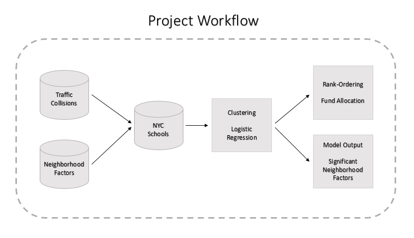

### Urban Science Intensive I Course, Spring 2016
### Project Title: __Identifying NYC Schools with high risk of Traffic Collisions__

__Team Members:__ 
Bhagwat Singh Bisht, Bilguun Turboli, Svarmit Singh Pasricha, Kiran Venkata Palla

This repository contains all the codes and data used for performing the analysis of the social impact project.

__Problem:__
In this project, various factors that are more likely to cause traffic injuries and fatalities for children around the elementary and middle school localities are studied and top 37 schools with the highest risk are identified across all boroughs. Specifically, the following questions are addressed throughout the analysis.

__1.__ Which factors contribute more towards traffic collisions around school neighborhoods?
__2.__ Are those school neighborhoods at high risk which have higher number of moving summons over a given period?
__3.__ Do the street quality in the school neighborhoods has a bigger influence on the traffic collisions? 
__4.__ How do the census characteristics of given area like demographics, income and education affect the traffic collisions around school neighborhoods?

__Approach:__
To address the earlier mentioned questions and to identify the top 37 schools with high risk of traffic collisions across all boroughs, the adopted approach included the application of clustering, regression analysis and rank ordering of the schools on the gathered data around traffic collisions, 311 complaints on street quality, moving summons issues by NYPD and census demographics data. Using the regression analysis technique, a risk score is developed for each elementary and middle school in New York City and then schools are rank ordered in the decreasing order to identify schools with high risk. Further in order to ensure the equity aspect across all boroughs, another borough based ranking is implemented and final 37 schools will be selected with a distribution that is equal to that of initial distribution of schools across the boroughs.

 

__Data Sources and Processing:__
Data processing was one of the challenging aspects of this project due to a diverse set of sources. At a broader level, data was collated for elementary and middle schools in NYC and futher traffic collisions in their neighbourhoods. Additional factors in school neighborhoods like street quality, speeding and census characteristics are also captured.

__1. NYC Schools:__ Which factors contribute more towards traffic collisions around school neighborhoods?
__2. Traffic Collisions:__ Are those school neighborhoods at high risk which have higher number of moving summons over a given period?
__3. Street Quality:__ Do the street quality in the school neighborhoods has a bigger influence on the traffic collisions? 
__4. Vehicle Speeding:__ How do the census characteristics of given area like demographics, income and education affect the traffic 
__5. Census Characteristics:__ 

__Analysis and Results:__

